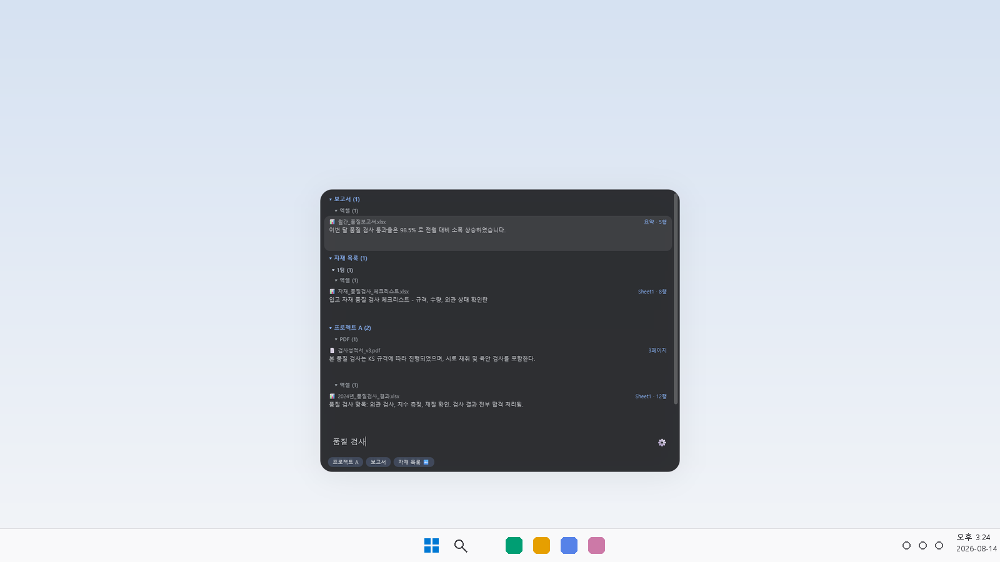
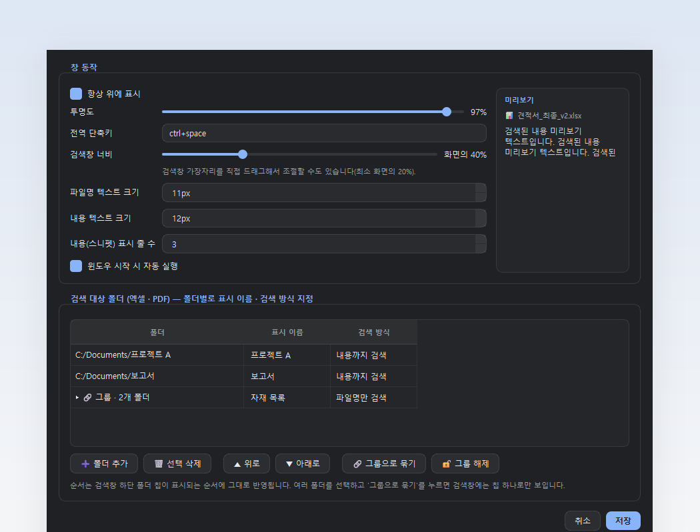

# KS-Finder (엑셀·PDF 내용 검색)

지정한 폴더 안의 엑셀(.xlsx/.xlsm)과 PDF 파일 내용을 색인해서, 전역 단축키로
언제든 띄울 수 있는 다크 테마 검색창에서 검색합니다. 결과는 검색창 위쪽으로
펼쳐집니다.

<p align="center">
  <br>
  <br>
  
</p>

## 다운로드 (Python 설치 없이 바로 실행)

**[Releases 페이지에서 최신 버전 받기](https://github.com/sol1010/KS-FINDER/releases/latest)**

- `KS-Finder-Setup.exe` — 설치 프로그램 (관리자 권한 불필요)
- `KS-Finder-portable.zip` — 압축 풀고 바로 실행 (설치 절차 없음)

## 실행 (개발용)

```bash
pip install -r requirements.txt
pythonw main.py
```

`python main.py`로 실행하면 검은 콘솔창이 같이 뜹니다. 콘솔창 없이 실행하려면
`python` 대신 `pythonw`를 쓰거나, `run_silent.vbs`를 더블클릭하세요.

실행하면 시스템 트레이에 아이콘이 생깁니다. 폴더가 설정되어 있지 않으면
옵션 창이 자동으로 뜹니다.

## 사용법

- 기본 단축키 `Ctrl+Space` 로 검색창 열기/닫기 (옵션에서 변경 가능)
- 트레이 아이콘 좌클릭으로도 열림
- 검색창에 입력 → 위쪽에 결과 목록 표시 (엑셀은 행 단위, PDF는 페이지 단위), 검색어와 일치하는 부분은 강조 표시됨
- 검색어에 공백으로 단어를 더 입력하면 이미 찾은 결과를 계속 좁혀나갈 수 있음(전부 포함하는 것만, 순서 무관)
- `↑` `↓` 로 결과 이동, `Enter` 또는 더블클릭으로 파일 열기
  - 엑셀(.xlsx/.xlsm)은 Excel이 설치되어 있으면 해당 시트·행으로 바로 이동해서 열림
  - PDF는 기본 뷰어가 Microsoft Edge, Adobe Acrobat/Reader, SumatraPDF, Foxit 중 하나면 해당 페이지로 바로 이동, 그 외 뷰어는 파일만 열림
- `Esc` 또는 창 밖 클릭 시 닫힘
- 검색창의 `⚙` 버튼 또는 트레이 메뉴 `옵션…` 에서:
  - 항상 위에 표시 on/off
  - 투명도 조절
  - 전역 단축키 변경
  - 검색 대상 폴더 추가/삭제 (여러 개 가능, 하위 폴더까지 재귀 검색)
  - 윈도우 시작 시 자동 실행
- 트레이 메뉴 `지금 색인 새로고침` 으로 수동 재색인 (변경된 파일만 다시 읽음)

## 색인 방식

- 파일의 수정시간/크기를 캐시(`%APPDATA%\KS-Finder\index_cache.json`)에
  저장해 두고, 변경되지 않은 파일은 다시 파싱하지 않습니다.
- 앱 시작 시, 검색창을 열 때마다, 그리고 5분마다 자동으로 백그라운드에서
  재색인합니다 — 새로 추가된 파일/폴더도 곧 검색됩니다. 변경 없는 파일은
  다시 읽지 않으므로 가볍습니다. 트레이 메뉴 `지금 색인 새로고침` 으로
  즉시 수동 실행할 수도 있습니다(이때만 완료 알림이 뜹니다).
- 실시간 파일시스템 감시(watch)는 아니라 폴링 방식이라, 아주 드물게 방금
  막 저장한 파일이 다음 자동 재색인(최대 5분 또는 다음 검색창 열기) 전에는
  안 보일 수 있습니다.

## 알려진 제약

- 구버전 `.xls` 형식은 지원하지 않습니다 (openpyxl 제약). 필요하면 `.xlsx`로
  변환해서 사용하세요.
- 스캔한 이미지로만 이루어진 PDF(텍스트 레이어 없음)는 내용 검색이 되지 않습니다.
- 전역 단축키(`keyboard` 라이브러리)는 관리자 권한으로 실행 중인 다른 창에
  포커스가 있을 때는 동작하지 않을 수 있습니다.

## exe로 빌드하기

```bash
pip install -r requirements.txt
build_exe.bat
```

`dist\KS-Finder\KS-Finder.exe` 가 생성됩니다(폴더 형태, PyInstaller `--onedir`).
콘솔창 없이 트레이로 바로 실행됩니다. 폴더 전체를 복사하면 Python이 없는 다른
컴퓨터에서도 그대로 실행할 수 있습니다.

## 설치 프로그램 만들기

exe를 먼저 빌드한 뒤, [Inno Setup](https://jrsoftware.org/isinfo.php)으로
`installer.iss`를 컴파일하면 관리자 권한 없이 설치되는(사용자 폴더 설치)
`KS-Finder-Setup.exe` 설치 프로그램을 만들 수 있습니다.

```bash
build_exe.bat
"경로\ISCC.exe" installer.iss
```

## 라이선스

[GPL-3.0](LICENSE)

## 파일 구성

| 파일 | 역할 |
|---|---|
| `main.py` | 진입점, 전체 모듈 연결 |
| `config.py` | 설정 로드/저장 (`%APPDATA%\KS-Finder\settings.json`) |
| `parsers.py` | 엑셀/PDF 텍스트 추출 |
| `indexer.py` | 폴더 스캔, 캐시, 검색 로직 |
| `index_worker.py` | 색인을 백그라운드 스레드에서 실행 |
| `hotkey_manager.py` | 전역 단축키 등록/해제 |
| `search_window.py` | 검색창 UI |
| `settings_dialog.py` | 옵션 창 UI |
| `tray_icon.py` | 시스템 트레이 아이콘/메뉴 |
| `startup.py` | 윈도우 시작프로그램 등록 (레지스트리) |
